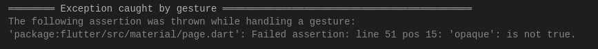
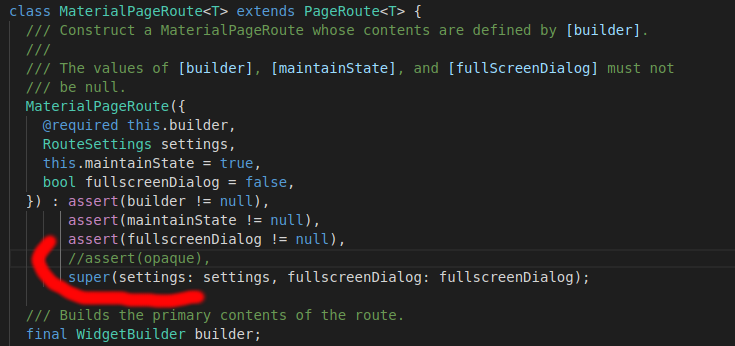

# Flutter v1.8.4

Унаследовался от MaterialPageRoute (класс TransparentPageRoute в папке util), переопределил opaque, который был true(теперь будет false), чтобы включить прозрачность на Detail Page.

Чтобы не было exception, закомментировал в оригинальном файле  фреймворка с классом MaterialPageRoute строку assert(opaque)

  

  

